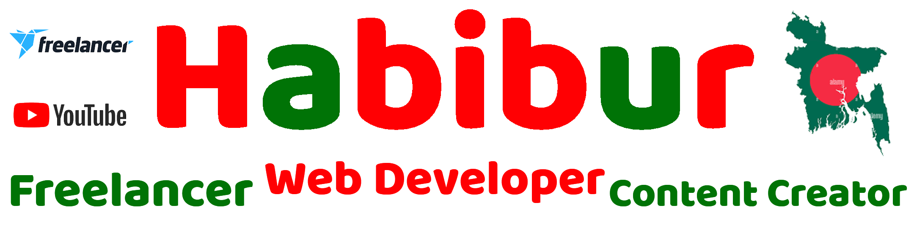

# Hi 👋 Myself Habib, I'm a Passionate <a href="https://www.freelancer.com/u/csehabiburr183"> Freelance </a> Web Developer.

<a href="https://www.youtube.com/c/adnanhabib">

    

</a>

# About Me

I'm a Freelance Web Developer by Profession & Passion!

I have a <strong>Youtube Channel</strong> too, do check it out! :wink:

# <strong> You Can Directly Hire Me with Lifetime $0 Fee </strong>

🔭 I’m currently working on freelancer.com as a web developer.  
🌱 I’m currently learning machine learning and iot.   
👯 I’m looking to collaborate on any web related project.  
💬 Ask me about any freelance work.  
📫 How to reach me: <a href="https://www.freelancer.com/u/csehabiburr183"> Contact With Me </a>  
⚡ Fun fact: I'm Student Of Computer Science and Engineering.

# Languages & Technology Stack:

    
    
    

🌐 &nbsp;    

🛢 &nbsp;
   
  
⚙️ &nbsp;
   

🎨 &nbsp;
    

 

 
